# projet_repertoire

Introduction du projet
---
L'objectif de cet exercice final est de mettre en pratique les concepts de programmation évènementielle avec Tkinter en créant un explorateur de fichiers simple.
Instructions :
1.	Interface Graphique : 
o	Créez une fenêtre principale avec un titre approprié (par exemple, "Explorateur de Fichiers").
o	Ajoutez une zone pour afficher la liste des fichiers et dossiers dans le répertoire courant.
2.	Barre de Chemin : 
o	Ajoutez une barre de chemin en haut de la fenêtre pour afficher le chemin du répertoire actuel.
o	Permettez à l'utilisateur de cliquer sur un dossier dans la barre de chemin pour naviguer directement vers ce dossier.
3.	Affichage des Fichiers et Dossiers : 
o	Lorsque la fenêtre s'ouvre, affichez les fichiers et dossiers du répertoire courant dans la zone de liste.
o	Mettez en évidence le dossier sélectionné.
4.	Navigation : 
o	Permettez à l'utilisateur de naviguer à travers les dossiers en double-cliquant sur un dossier dans la liste.
o	Assurez-vous que la barre de chemin et la liste des fichiers se mettent à jour après chaque changement de dossier.
5.	Options Contextuelles : 
o	Ajoutez des options contextuelles (clic droit) pour chaque élément de la liste (par exemple, Ouvrir, Supprimer, Renommer).
o	Implémentez les fonctionnalités correspondantes à ces options.
6.	Création de Nouveaux Dossiers : 
o	Ajoutez un bouton ou une option pour permettre à l'utilisateur de créer un nouveau dossier dans le répertoire courant.
7.	Filtrage des Fichiers : 
o	Ajoutez une option pour filtrer les fichiers dans la liste (par exemple, afficher uniquement les fichiers texte ou les images).
8.	Bouton Actualiser : 
o	Ajoutez un bouton "Actualiser" pour mettre à jour la liste des fichiers après des modifications (ajout, suppression, renommage).
9.	Interface Visuelle : 
o	Assurez-vous que l'interface est conviviale et intuitive, avec des icônes pour les dossiers et les fichiers.
10.	Affichage des fichiers ou dossiers Favoris: 
o	L’utilisateur doit pouvoir marquer un fichier ou un dossier comme favori dans le menu contextuel de votre Explorateur de fichier.
o	Quand l’utilisateur appuie sur l’option Favoris (Favorites) à gauche, il doit pouvoir lister les fichiers ou dossiers qu’il avait marqué comme favoris
11 :
•	Implémentez une fonction de recherche pour permettre à l'utilisateur de trouver rapidement un fichier dans la liste.
12:
•	Ajoutez des informations sur les fichiers sélectionnés (taille, date de création, etc.).
13:
•	Gérez les erreurs (par exemple, accès refusé) de manière élégante.

Liens utiles
---
github.com

google.com

Screenshots
---
L'interface se presente comme sur l'image suivante:
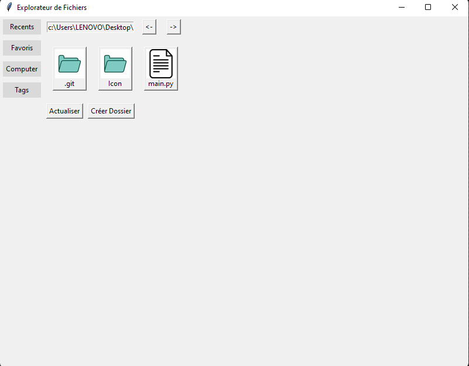

Pour créer un nouveau dossier nous allons cliquez sur le bouton "Créer Dossier" et ça nous donne la main en demandant le nom du dossier:
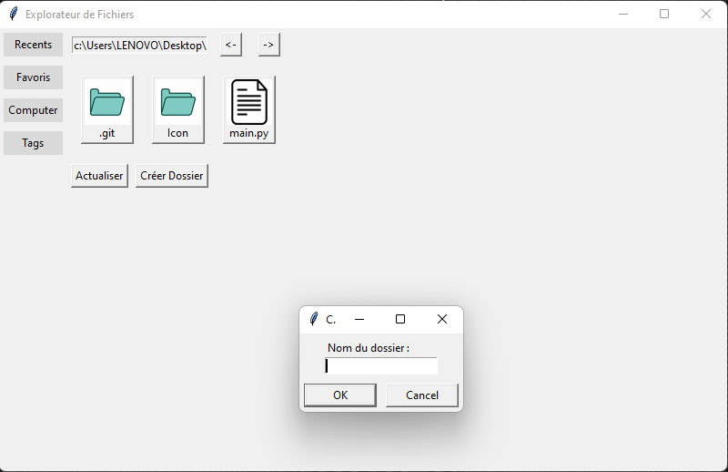

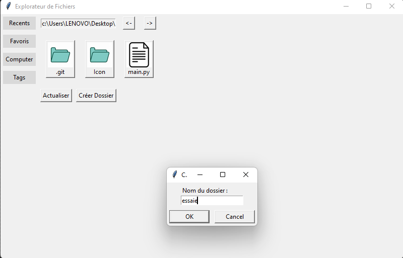

On voit là que le dossier "essaie" est créé:
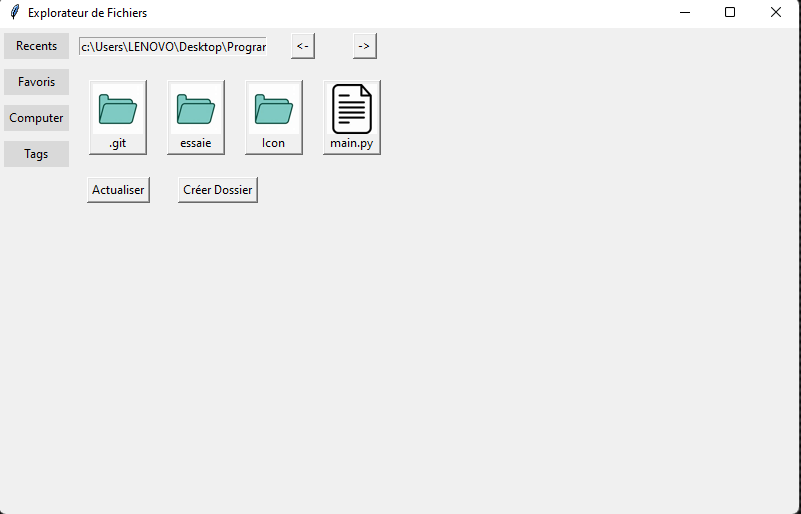

Un clic droit sur ce dossier nous permet d'afficher des options "Ouvrir","Renommer",Supprimer","Ajouter aux Favoris".
L'option "Renommer" nous permet de changer le nom du fichier ou du dossier. Changeons "essaie" en "nouveau_nom":
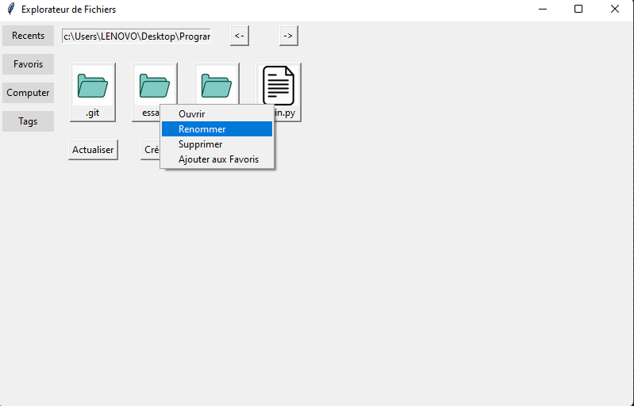

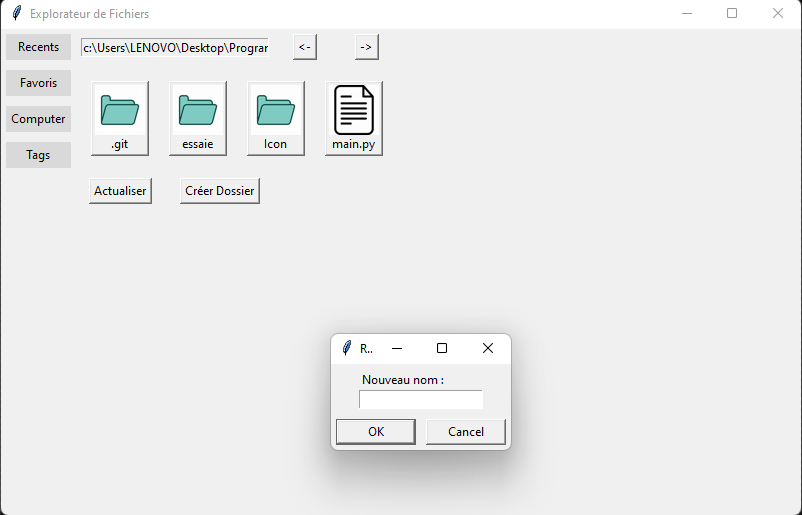

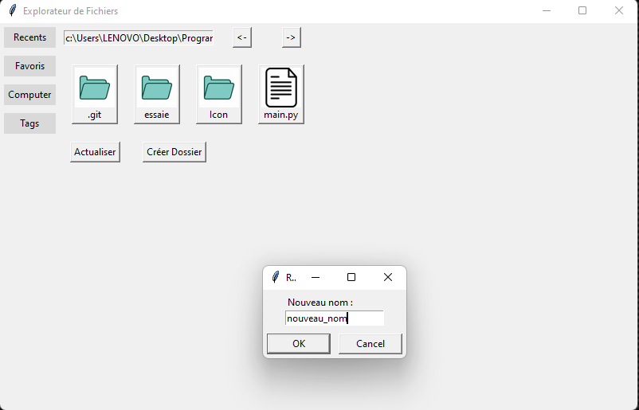

Le dossier à été renommé en "nouvea_dossier" comme on le voit sur l'image:
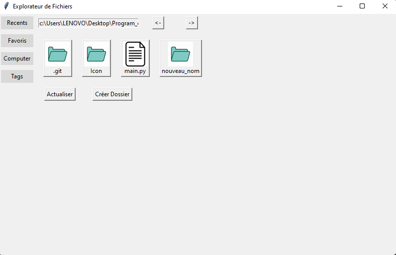

L'option "Ajouter aux Favoris" :
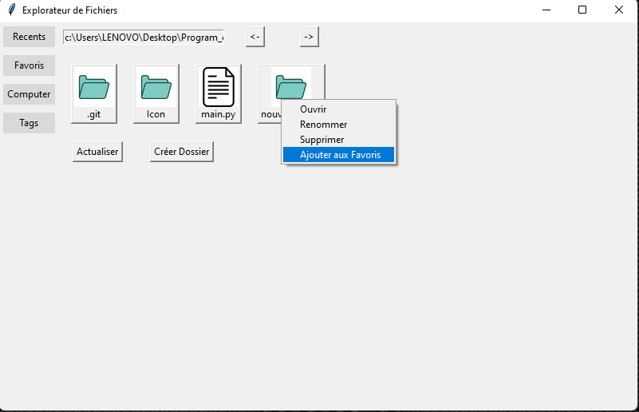

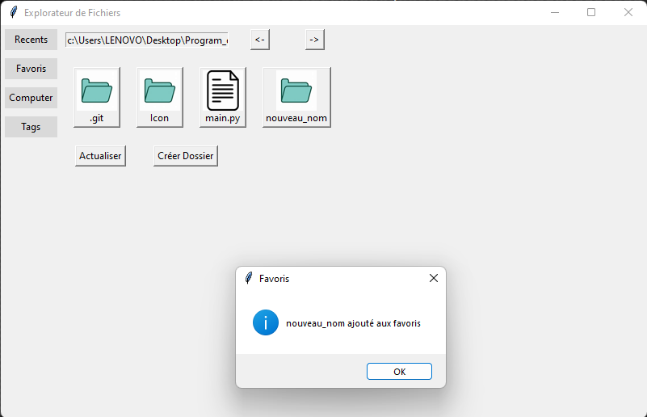

Dans la liste "Favoris" on remarque que le dossier est belle et bien venu:
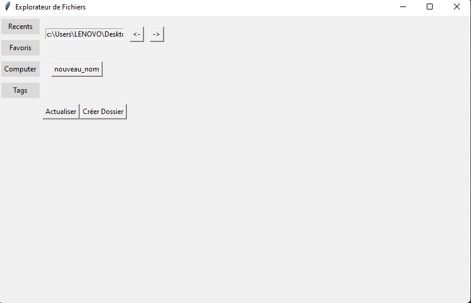

L'option "Supprimer" :
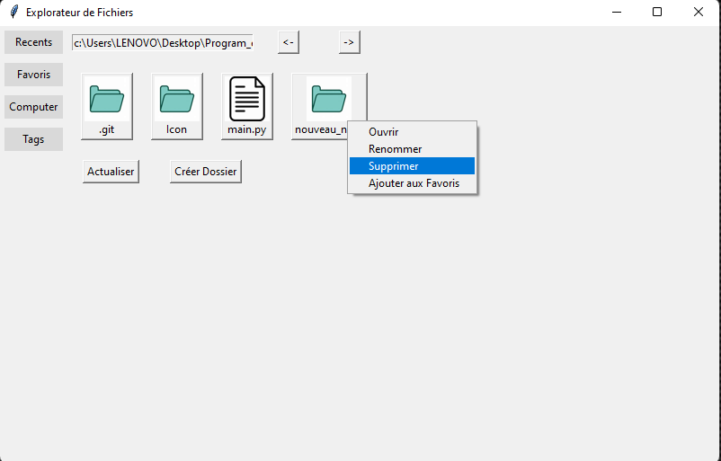

La fenetre après la suppression:
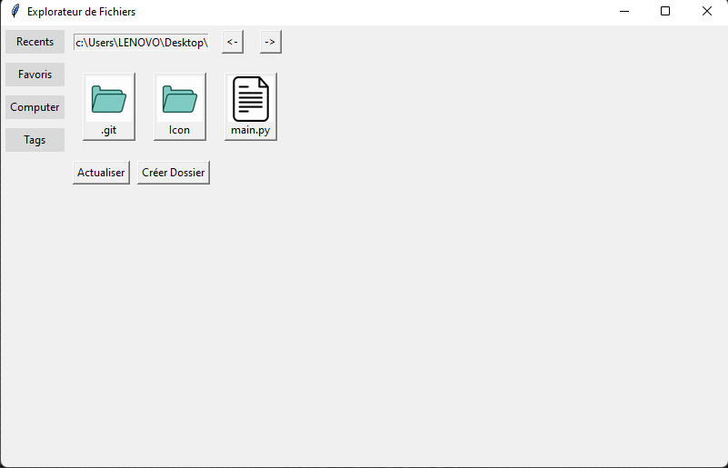

Difficultés et solutions
---

Pour le projet, l'utilisation d'une bibliothèque pour la gestion d'image était nécessaire au niveau des icons. Nous avons donc utiliser PIL, celui ci n'etant pas déjà installer nous avions utiliser la commande suivante dans le Terminal:

'''bash
pip install Pillow

